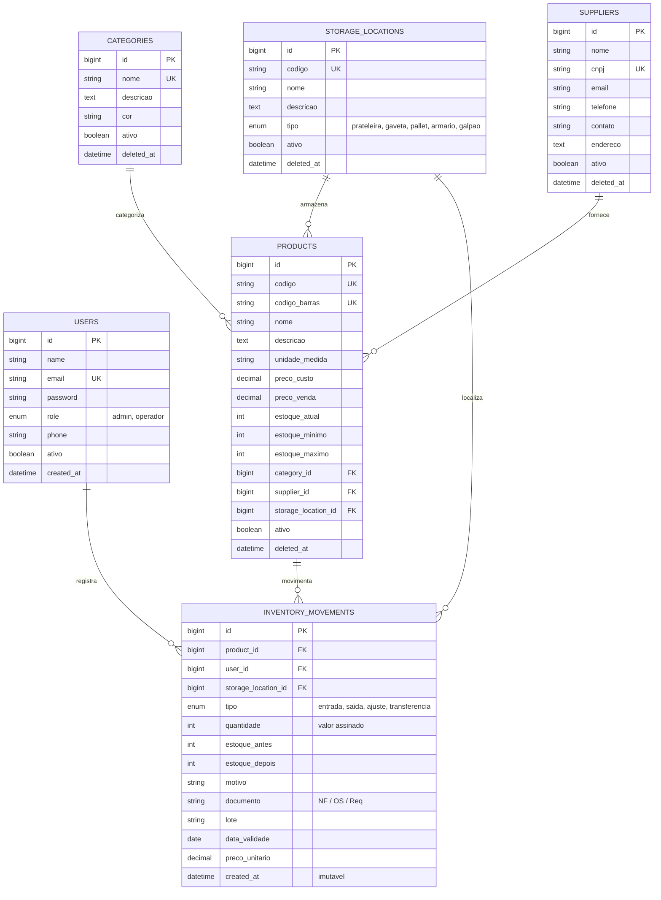

# Documentação Técnica — Sistema Inteligente de Gerenciamento de Inventário

**Instituição:** SESI / SENAI — Curso Técnico em Desenvolvimento de Sistemas  
**Unidade:** Rua Senador Accioly Filho, 298 — Cidade Industrial de Curitiba/PR  
**Tecnologias:** PHP 8.2, Laravel 12, MySQL 8.0, Blade Templates, Tailwind CSS v4, Chart.js, Vite  
**Repositório:** [https://github.com/DiRibei/SESI-Inventario](https://github.com/DiRibei/SESI-Inventario)

---

## 1. Visão Geral da Arquitetura

O **Sistema Inteligente de Gerenciamento de Inventário** foi concebido para eliminar o controle manual em planilhas eletrônicas no almoxarifado do SESI/SENAI, provendo rastreabilidade total, integridade referencial, bloqueio de estoque negativo e visibilidade analítica em tempo real através de dashboards e relatórios consolidados.

### Pilha Tecnológica (Tech Stack)
- **Backend Framework:** Laravel 12.x sobre PHP 8.2 (XAMPP)
- **Banco de Dados Relacional:** MySQL 8.0 (porta 3307)
- **Camada de Apresentação:** Laravel Blade com Server-Side Rendering (SSR) e micro-interatividades em Vanilla JS / Alpine.js
- **Estilização e Design System:** Tailwind CSS v4 com integração `@tailwindcss/vite` e paleta institucional do SESI/SENAI
- **Visualização de Dados:** Chart.js v4 integrado aos componentes de Dashboard
- **Controle de Versão:** Git e GitHub com branch única de produção (`main`)

---

## 2. Modelagem do Banco de Dados Relacional (DER)

O banco de dados foi normalizado para assegurar consistência, histórico imutável e integridade referencial com chaves estrangeiras (`FOREIGN KEY`) e deleção lógica (`SoftDeletes`) nos cadastros mestres.



---

## 3. Regras de Negócio e Mecanismos de Integridade

### 3.1 Transações Atômicas e Concorrência (`DB::transaction`)
Todas as movimentações de estoque são executadas em bloco atômico no banco de dados. No `InventoryMovementController@store`:
1. É obtido o lock pessimista da linha do produto através de `Product::lockForUpdate()->findOrFail($id)`.
2. O sistema valida se `tipo === 'saida'` e se a quantidade requerida é menor ou igual ao `estoque_atual`.
3. Se houver tentativa de saída superior ao saldo disponível, é lançada uma `ValidationException`, abortando a transação e impedindo qualquer valor negativo no saldo.
4. O saldo do produto é atualizado com o novo valor calculado (`estoque_depois = estoque_antes + delta`).
5. É gerado o registro histórico imutável na tabela `inventory_movements`, contendo o estado antes e depois da operação, o responsável autenticado (`auth()->id()`), documento de rastreio e data/hora.

### 3.2 Imutabilidade da Trilha de Auditoria
A tabela `inventory_movements` **não** possui rotas de edição (`update`) nem de exclusão (`destroy`). Uma vez registrado, o lançamento compõe a trilha perene de auditoria do almoxarifado. Em caso de divergências ou enganos, deve ser registrado um novo lançamento corretivo do tipo `ajuste` devidamente justificado.

### 3.3 Alertas Automáticos de Estoque Mínimo
No modelo `Product`, o escopo `scopeEstoqueCritico` e o método `isEstoqueCritico()` avaliam em tempo real:
$$\text{estoque\_atual} \le \text{estoque\_minimo}$$
Esses itens disparam automaticamente:
- Indicadores pulsantes no topo da barra de navegação global.
- Cards de alerta destacados em vermelho no Dashboard principal com priorização por urgência $(\text{estoque\_atual} - \text{estoque\_minimo})$.
- Filtro imediato de consulta por checkbox na listagem de materiais.

---

## 4. Controle de Acesso e Perfis de Usuário (RBAC)

A autorização é governada por Middlewares dedicados:
- **Operador (`EnsureIsOperador`):**
  - Acesso ao Dashboard e KPIs em tempo real.
  - Consulta do catálogo completo de produtos, níveis de saldo e localizações físicas.
  - Registro de movimentações de estoque (entradas, requisições de saída, ajustes de inventário).
  - Consulta e emissão de relatórios gerenciais e comprovantes de movimentação.
  - Acesso ao manual operacional interativo do sistema.
- **Administrador (`EnsureIsAdmin`):**
  - Todas as prerrogativas do perfil Operador.
  - Cadastro, alteração e exclusão lógica de Produtos.
  - Gestão de Fornecedores, Categorias de Materiais e Locais de Armazenamento.
  - Gestão de Usuários (criação de contas, alteração de perfis e reset de senhas).

---

## 5. Mapeamento de Rotas do Sistema

| Método | URI | Nome da Rota | Acesso | Finalidade |
|---|---|---|---|---|
| `GET` | `/` | — | Público | Redireciona para o login |
| `GET/POST`| `/login` | `login` | Público | Autenticação com sessão segura |
| `GET` | `/dashboard` | `dashboard` | Autenticado | Painel de controle, KPIs e gráficos |
| `GET` | `/products` | `products.index` | Autenticado | Catálogo de materiais e busca rápida |
| `GET` | `/products/{product}` | `products.show` | Autenticado | Ficha detalhada do produto |
| `GET` | `/products/create` | `products.create` | Admin | Formulário de novo material |
| `POST`| `/products` | `products.store` | Admin | Gravação de novo material |
| `GET` | `/products/{product}/edit` | `products.edit` | Admin | Edição cadastral do material |
| `PUT` | `/products/{product}` | `products.update` | Admin | Atualização cadastral |
| `DELETE`| `/products/{product}` | `products.destroy` | Admin | Exclusão lógica (soft delete) |
| `GET` | `/inventory-movements` | `inventory-movements.index` | Autenticado | Histórico de movimentações |
| `GET` | `/inventory-movements/create` | `inventory-movements.create` | Autenticado | Formulário de entrada/saída |
| `POST`| `/inventory-movements` | `inventory-movements.store` | Autenticado | Processamento com lock atômico |
| `GET` | `/inventory-movements/{id}` | `inventory-movements.show` | Autenticado | Comprovante de auditoria |
| `GET` | `/reports` | `reports.index` | Autenticado | Relatórios com filtros e impressão |
| `GET` | `/reports/export-csv` | `reports.export-csv` | Autenticado | Exportação para Excel (CSV UTF-8) |
| `GET` | `/manual` | `manual.index` | Autenticado | Manual do usuário integrado no app |
| `RESOURCE`| `/categories` | `categories.*` | Admin | Gestão de categorias |
| `RESOURCE`| `/suppliers` | `suppliers.*` | Admin | Gestão de fornecedores |
| `RESOURCE`| `/storage-locations` | `storage-locations.*` | Admin | Gestão de locais físicos |
| `RESOURCE`| `/users` | `users.*` | Admin | Gestão de acessos e operadores |

---

## 6. Procedimento de Instalação e Execução Local

### Pré-requisitos
- PHP 8.2 ou superior com extensões `pdo_mysql`, `mbstring`, `openssl`, `tokenizer`, `xml`, `ctype`, `json`, `fileinfo`.
- Composer 2.x
- Node.js 20+ e npm
- MySQL Server ativo na porta 3307 (ou configurável no `.env`)

### Passos de Execução
```bash
# 1. Clonar repositório
git clone https://github.com/DiRibei/SESI-Inventario.git
cd SESI-Inventario

# 2. Instalar dependências PHP
composer install

# 3. Configurar ambiente
cp .env.example .env
php artisan key:generate

# 4. Executar migrações com dados de teste realistas do SENAI
php artisan migrate:fresh --seed

# 5. Instalar dependências de frontend e compilar assets
npm install
npm run build

# 6. Iniciar servidor local
php artisan serve --port=8000
```

Acesse a aplicação em `http://127.0.0.1:8000`.
